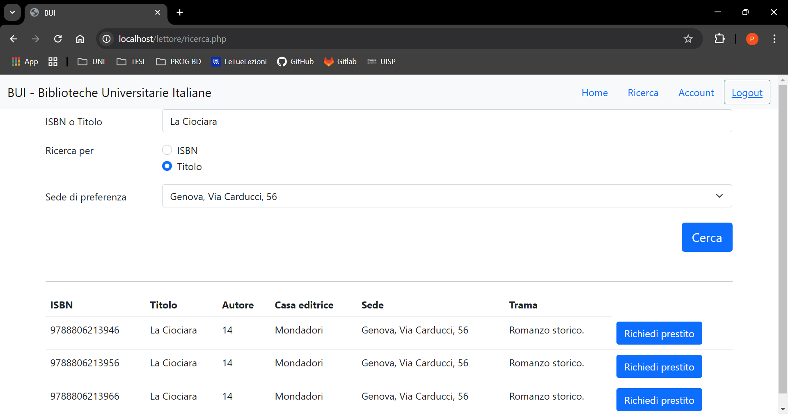

# Documentazione tecnica | *2024-25*

## Indice

- [Base di dati](#base-di-dati)
    - [Schema concettuale (ER)](#schema-concettuale-er)
    - [Schema concettuale ristrutturato](#schema-concettuale-ristrutturato)
    - [Schema logico](#schema-logico)
    - [Motivazioni della traduzione da ER a logico](#motivazioni-della-traduzione-da-er-a-logico)
    - [Scelte implementative](#scelte-implementative)
        - [UUID - id utenti](#uuid---id-utenti)
        - [pg_crypto - hashing delle password](#pg_crypto---hashing-delle-password)
        - [COALESCE() - update dei dati](#coalesce---update-dei-dati)
    - [Funzioni realizzate](#funzioni-realizzate)
        - [Procedure](#procedure)
        - [Funzioni](#funzioni)
        - [Triggers](#triggers)

## Base di dati

### Schema concettuale (ER)


### Schema concettuale ristrutturato


### Schema logico
Utenti (**id**, CF, nome, cognome, password)  
Lettori (**utenti**, categoria, prestiti_ritardo)  
Bibliotecari (**utenti**)  
Autore (**id**, nome, cognome, data_nascita, data_morte, biografia)  
Libro (**ISBN**, titolo, *autore*, trama, casa editrice)  
Sede (**id**, città, indirizzo, civico)  
Scrittura (***autore***, ***libro***)  
Copia (**id**, *libro*, sede, disponibilità, rimossa)  
Prestiti (**id**, *lettore*, *copia*, data_inizio, scadenza, data_restituzione)

### Motivazioni della traduzione da ER a logico

- Associazioni "**IS-A**" sono state tradotte inserendo all'interno delle tabelle lettori e bibliotecari una chiave esterna alla tabella utenti, essendo una generalizzazione di essa.

- L'associazione "**Distribuisce**" è stata tradotta inserendo una chiave esterna dentro la tabella copie.

- L'associazione "**Stampa**" è stata tradotta inserendo dentro la tabella copia una chiave esterna ISBN.

### Scelte implementative

#### **UUID** - id utenti

```sql
CREATE TABLE utenti (
    id uuid PRIMARY KEY DEFAULT gen_random_uuid(),
    ...
);
```

Gli UUID offrono vantaggi significativi come l'unicità globale, che evita collisioni su sistemi diversi, e la scalabilità, permettendo la generazione di ID unici senza necessità di un coordinamento centrale.

#### **pg_crypto** - hashing delle password

```sql
CREATE OR REPLACE FUNCTION utenti_insert()
...
    NEW.password = crypt(NEW.password, gen_salt('bf'));
...
$$;
```

Ho deciso di utilizzare l'estensione `pg_crypto` per l'hashing delle password nel momento in cui vengono inserite nel DB.

#### **COALESCE()** - update dei dati

```sql
...
    nome    = INITCAP(COALESCE(NULLIF(_nome, ''), nome)),
...
```

Ho utilizzato la funzione COALESCE() nelle procedure di update, la funzione ritorna il primo dato non NULL fra quelli inseriti, in questo modo viene effetuato l'update solo se il dato è valido.

### Funzioni realizzate

#### Procedure
- **utente_update_demo**: Modifica i campi non nulli dell'utente con l'ID dato.
- **utente_update_password**: Modifica la password dell'utente con l'ID dato, controllando la vecchia password.
- **utente_update_password_admin**: Modifica la password dell'utente con l'ID dato. Solo per amministratori.
- **lettore_new**: Aggiunge un nuovo lettore con i dati forniti (nome, cognome, password, codice fiscale). Solo per amministratori.
- **lettore_upgrade**: Modifica la categoria del lettore a 'premium'. Solo per amministratori.
- **lettore_downgrade**: Modifica la categoria del lettore a 'base'. Solo per amministratori.
- **bibliotecario_new**: Aggiunge un nuovo bibliotecario con i dati forniti (nome, cognome, password, codice fiscale). Solo per amministratori.
- **autore_new**: Aggiunge un nuovo autore con i dati forniti (nome, cognome, data di nascita, data di morte, biografia). Solo per amministratori.
- **autore_update**: Modifica i campi non nulli dell'autore con l'ID dato. Solo per amministratori.
- **libro_new**: Aggiunge un nuovo libro con i dati forniti (ISBN, titolo, autore, trama, casa editrice).
- **copia_new**: Aggiunge una nuova copia di un libro in una sede specificata. Solo per amministratori.
- **copia_new_N**: Aggiunge N copie di un libro in una sede specificata. Solo per amministratori.
- **sede_new**: Aggiunge una nuova sede con i dati forniti (città, indirizzo, civico). Solo per amministratori.
- **sede_update**: Modifica i dati della sede con l'ID dato. Solo per amministratori.
- **prestito_new**: Aggiunge un nuovo prestito con i dati forniti (lettore, copia).
- **prestito_restituzione**: Restituisce un prestito attivo con i dati forniti (lettore, copia). Solo per amministratori.
- **prestito_proroga**: Proroga di 14 giorni la data di scadenza di un prestito attivo con i dati forniti (lettore, copia). Solo per amministratori.
- **reset_ritardi**: Azzera il conteggio delle riconsegne in ritardo del lettore con l'ID dato. Solo per amministratori.

#### Funzioni

- **autore_new_function**: Crea una nuova funzione autore.
- **check_login**: Verifica le credenziali di accesso.
- **copia_new_function**: Richiama la procedura new_copia_N e ritorna (successo, messaggio).
- **get_autore**: Recupera le informazioni di un autore.
- **get_autori**: Recupera la lista di tutti gli autori.
- **get_bibliotecario**: Recupera le informazioni di un bibliotecario.
- **get_categoria_ritardi_lettore**: Recupera la categoria di ritardi di un lettore.
- **get_copie_disponibili**: Recupera le copie disponibili.
- **get_copie_disponibili_libro**: Recupera le copie disponibili di un libro.
- **get_copie_libro**: Recupera tutte le copie di un libro.
- **get_copie_libro_sede**: Recupera le copie di un libro in una sede specifica.
- **get_copie_sede**: Recupera tutte le copie in una sede specifica.
- **get_lettore**: Recupera le informazioni di un lettore.
- **get_lettore_cf**: Recupera le informazioni di un lettore tramite codice fiscale.
- **get_libri**: Recupera la lista di tutti i libri.
- **get_libri_autore**: Recupera i libri di un autore specifico.
- **get_libri_disponibili_by_isbn**: Recupera i libri disponibili tramite ISBN.
- **get_libri_disponibili_by_isbn_sede**: Recupera i libri disponibili tramite ISBN in una sede specifica.
- **get_libri_disponibili_by_titolo**: Recupera i libri disponibili tramite titolo.
- **get_libri_disponibili_by_titolo_sede**: Recupera i libri disponibili tramite titolo in una sede specifica.
- **get_libri_sede**: Recupera i libri in una sede specifica.
- **get_libri_titolo**: Recupera i libri tramite titolo.
- **get_libro**: Recupera le informazioni di un libro.
- **get_prestiti_attivi**: Recupera i prestiti attivi.
- **get_prestiti_attivi_lettore**: Recupera i prestiti attivi di un lettore.
- **get_prestiti_copia**: Recupera i prestiti di una copia specifica.
- **get_prestiti_in_tempo**: Recupera i prestiti restituiti in tempo.
- **get_prestiti_lettore**: Recupera i prestiti di un lettore.
- **get_prestiti_ritardati**: Recupera i prestiti ritardati.
- **get_prestito**: Recupera le informazioni di un prestito.
- **get_prima_copia_disponibile**: Recupera la prima copia disponibile di un libro.
- **get_sede**: Recupera le informazioni di una sede.
- **get_sedi**: Recupera la lista di tutte le sedi.
- **libro_new_function**: Richiama la procedura new_libro e ritorna (successo, messaggio).
- **report_ritardi_sedi**: Genera un report dei ritardi per sede.
- **richiesta_prestito**: Gestisce la richiesta di un prestito.

#### Triggers

- **utenti_insert**: Mette il CF in maiuscolo e la password in hash.
- **controllo_ritardi**: Blocco prestiti a lettori ritardatari.
- **controllo_prestiti_attivi**: Limite prestiti attivi per lettore.
- **controllo_ritardi_restituzione**: Penalizzazione per ritardi nelle restituzioni.
- **aggiorna_disponibilità_prestito**: Aggiorna disponibilità delle copie quando viene effettuato un prestito.
- **aggiorna_disponibilità_restituzione**: Aggiorna disponibilità delle copie quando viene effettuata una restituzione.
- **controllo_disponibilità**: Controlla la disponibilità delle copie prima di effettuare un prestito.
- **controllo_proroga**: Controlla le condizioni per la proroga dei prestiti.
- **aggiorna_statistiche_sedi**: Aggiorna automaticamente le statistiche delle sedi.
- **prestiti_insert**: Imposta dataInizio e scadenza per i nuovi prestiti.
- **prestiti_delete**: Aggiorna disponibilità delle copie e decrementa riconsegne_ritardo se necessario.
- **controllo_prestito_attivo**: Controlla che il lettore non abbia già un prestito attivo per lo stesso libro.

### Requisiti e come sono stati soddisfatti

- **Blocco prestiti a lettori ritardatari**: Un prestito può essere concesso solo se il lettore che lo richiede ha meno di 5 riconsegne in ritardo all’attivo.
  - Questo requisito è stato soddisfatto tramite il trigger `controllo_ritardi`, che blocca i prestiti ai lettori con più di 5 ritardi.

- **Numero massimo di prestiti**: I lettori di categoria base possono avere al massimo 3 volumi in prestito allo stesso tempo, mentre i lettori di categoria premium possono averne al massimo 5.
  - Questo requisito è stato soddisfatto tramite il trigger `controllo_prestiti_attivi`, che limita il numero di prestiti attivi per lettore in base alla loro categoria.

- **Ritardi nelle restituzioni**: Alla restituzione di un volume, se effettuata in ritardo, è necessario aggiornare il contatore dei ritardi del lettore.
  - Questo requisito è stato soddisfatto tramite il trigger `controllo_ritardi_restituzione`, che aggiorna il contatore dei ritardi del lettore alla restituzione di un volume in ritardo.

- **Disponibilità dei volumi**: Un prestito può essere concesso solo se il volume richiesto è disponibile. La disponibilità di ogni volume va sempre mantenuta aggiornata rispetto ai prestiti in atto.
  - Questo requisito è stato soddisfatto tramite i trigger `aggiorna_disponibilità_prestito` e `aggiorna_disponibilità_restituzione`, che aggiornano la disponibilità delle copie quando viene effettuato un prestito o una restituzione.

- **Proroga della durata di un prestito**: La proroga della durata di un prestito (fatta dal bibliotecario, si vedano i requisiti dell’applicazione Web) può essere concessa solo se il prestito non si trova già in ritardo.
  - Questo requisito è stato soddisfatto tramite il trigger `controllo_proroga`, che controlla le condizioni per la proroga dei prestiti.

- **Selezione della sede**: Per inserire un prestito, insieme al codice ISBN o al titolo del libro, il lettore può specificare una delle sedi della biblioteca. Se il lettore specifica una sede, il prestito può essere fatto solo su una delle copie presenti nella sede specificata. Solo se il libro richiesto non ha copie disponibili presso la sede specificata, è possibile considerare copie presso le altre sedi, a patto che il lettore ne venga opportunamente avvisato.
  - Questo requisito è stato soddisfatto tramite le funzioni `get_copie_libro_sede` e `get_copie_disponibili`, che recuperano le copie disponibili di un libro in una sede specifica o in tutte le sedi.

- **Statistiche per ogni sede**: È necessario mantenere, per ogni sede, il numero totale delle copie gestite dalla sede, il numero totale dei codici ISBN gestiti dalla sede, ed il numero totale di prestiti in corso per volumi mantenuti dalla sede.
  - Questo requisito è stato soddisfatto tramite il trigger `aggiorna_statistiche_sedi`, che aggiorna automaticamente le statistiche delle sedi.

- **Ritardi per ogni sede**: È necessario generare un report, per ogni sede, dove sono indicati i libri in prestito in ritardo e i lettori che li hanno in carico.
  - Questo requisito è stato soddisfatto tramite la funzione `report_ritardi_sedi`, che genera un report dei ritardi per sede.


## Web app

### Login

<div align="center">
    
</div>
<br>

### Lettore

#### Home page
<div align="center">
    
</div>
<br>

#### Profilo
<div align="center">
    
</div>
<br>

#### Cambia password
<div align="center">
    
</div>
<br>

#### Ricerca libri
<div align="center">
    
</div>
<br>

### Bibliotecario

#### Home page
<div align="center">
    
</div>
<br>

#### Gestione utenti
<div align="center">
    
    <br>
    
</div>
<br>

#### Gestione libri
<div align="center">
    
    <br>
    
    <br>
    
    <br>
    
</div>
<br>
